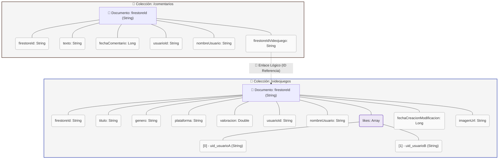

# Diseño de Base de Datos y Modelo Híbrido (SQL & NoSQL)
## Proyecto Final - Desarrollo de Aplicaciones Multiplataforma (DAM)
Otrappartida es una aplicación que surge de la necesidad de gestionar la colección de videojuegos usados por los gamers. Cada videojuego es un objeto con atributos como género, plataforma, valoración y otros datos que lo diferencian. Cada usuario posee su propia biblioteca de videojuegos, identificada por un ID único, y puede registrar, valorar y seguir el progreso de sus juegos, facilitando la organización y el seguimiento de su catálogo personal.
Este documento contiene una guía técnica exhaustiva y redactada profesionalmente sobre el diseño, arquitectura y justificación de la base de datos para la memoria de tu **Proyecto Final de DAM**. 

Incluye los diagramas entidad-relación (ER), el paso a tablas (modelo relacional) para la base de datos local SQL (SQLite/Room), el esquema de base de datos NoSQL (Cloud Firestore), y la justificación del uso de una **arquitectura híbrida (SQL + NoSQL)**, un factor diferenciador que aportará un enorme valor técnico a tu proyecto ante el tribunal.

---

## 1. Justificación Arquitectónica: El Modelo Híbrido (SQL + NoSQL)

En el desarrollo de aplicaciones móviles y multiplataforma modernas, depender de una única base de datos centralizada suele obligar a comprometer el rendimiento, la escalabilidad o la experiencia de usuario sin conexión (*Offline-First*). Por ello, este proyecto implementa una **arquitectura híbrida y complementaria**:

| Dimensión | Base de Datos SQL Local (Room / SQLite) | Base de Datos NoSQL Cloud (Firestore) |
| :--- | :--- | :--- |
| **Tecnología** | Room Database (abstracción oficial de SQLite en Android) | Google Cloud Firestore (Base de datos documental orientada a la nube) |
| **Uso Principal** | Almacenamiento local, persistencia offline, configuración de usuario y progreso individual de juego. | Sincronización en la nube, catálogo social comunitario, interacciones en tiempo real (likes, comentarios públicos). |
| **Modelo de Datos** | Relacional (Tablas estructuradas, claves foráneas, índices, restricciones). | Jerárquico orientado a documentos (Colecciones, documentos, arreglos/mapas embebidos). |
| **Ventaja Clave** | Rendimiento ultra rápido, funcionamiento 100% offline, integridad referencial estricta para el usuario. | Escalabilidad masiva horizontal, actualizaciones en tiempo real (*Real-time stream*), facilidad para compartir datos comunitarios. |

### Flujo de Sincronización y Responsabilidades
1. **Firebase Authentication** actúa como nexo de unión, proporcionando un `uid` (User ID) único global para cada usuario tras el login.
2. **Room (SQL Local)** almacena la información de sesión (`usuarios`), las valoraciones individuales (`valoraciones`) y el progreso personal de cada juego en la biblioteca del usuario (`usuarios_videojuegos`).
3. **Firestore (NoSQL Nube)** hospeda el catálogo global compartido de videojuegos (`videojuegos`) y la lista colectiva de comentarios (`comentarios`), permitiendo interacciones comunitarias inmediatas como el conteo de *likes* y aportaciones colectivas en tiempo real.

---

## 2. Parte SQL: Base de Datos Relacional Local (Room / SQLite)

La base de datos relacional local garantiza la persistencia, integridad y consistencia del estado del usuario cuando la aplicación no dispone de acceso a Internet.

### 2.1 Diagrama Entidad-Relación Conceptual (ERD)

A continuación, se detalla el diagrama Entidad-Relación conceptual en notación unificada. Representa las entidades principales del sistema local, sus atributos y la naturaleza de sus relaciones:


> **Nota:** El diagrama se muestra arriba como una imagen renderizada del modelo entidad‑relación en notación Chen. Si prefieres la versión Mermaid para editarla, está disponible en la rama anterior del documento.

---

### 2.2 Explicación de Relaciones y Cardinalidades

#### A. Relación de Asociación (Many-to-Many) entre Usuario y Videojuego
- **Entidades implicadas:** `Usuario` y `Videojuego`.
- **Explicación:** Un usuario puede registrar múltiples videojuegos en su biblioteca personal. Del mismo modo, un mismo videojuego (por ejemplo, *The Legend of Zelda*) puede ser guardado por múltiples usuarios en sus respectivas bibliotecas.
- **Implementación (Paso a Tablas):** Al tratarse de una relación de muchos a muchos ($N:M$), no se puede mapear directamente con una clave foránea simple. Se introduce una **tabla intermedia** llamada `usuarios_videojuegos` (entidad asociativa `UsuarioVideojuego`). 
- **Atributos de relación:** Esta tabla no solo conecta los dos identificadores, sino que además almacena metadatos específicos del progreso del usuario con ese juego, tales como el `estado` de juego (ej. *"Completado"*, *"Jugando"*), si es un juego `favorito` para él, las `horasJugadas`, y las marcas temporales `fechaInicio` y `fechaFin`.

#### B. Relación de Creación (One-to-Many) entre Usuario y Videojuego
- **Entidades implicadas:** `Usuario` (1) y `Videojuego` (N).
- **Explicación:** Un usuario es el responsable original de registrar o insertar un videojuego en el catálogo del sistema. Por lo tanto, un `Usuario` puede registrar muchos ($N$) videojuegos, pero un `Videojuego` local en la tabla base es referenciado al creador original que lo añadió mediante la columna `usuarioId`.

#### C. Relación de Interacción: Valoraciones (One-to-Many)
- **Valoraciones:** Un `Usuario` puede calificar muchos videojuegos; un `Videojuego` puede recibir muchas calificaciones. Sin embargo, para evitar que un usuario manipule las estadísticas de un videojuego votándolo repetidamente, se añade una **restricción de índice único compuesto** sobre la pareja `(usuarioId, videojuegoId)` en la entidad `Valoracion`. Esto limita a un máximo de **1 valoración por usuario por videojuego**.

---

### 2.3 Paso a Tablas (Modelo Relacional Lógico)

A continuación, se muestra la traducción formal de las entidades conceptuales a esquemas de tablas físicas SQL, detallando los tipos de datos en SQLite, claves primarias (PK), claves foráneas (FK) y restricciones de integridad:

#### Tabla 1: `usuarios`
Mantiene la información de los perfiles de usuario registrados en la app.
*   **Esquema:** `usuarios(uid [TEXT, PK], nombre [TEXT], email [TEXT], fechaRegistro [INTEGER], avatarUrl [TEXT, NULL])`
*   **Restricciones:**
    *   `uid` es la clave primaria. El valor es provisto externamente por Firebase Auth, asegurando coherencia global.
    *   `email` posee un **Índice Único** (`UNIQUE INDEX`), impidiendo la existencia de dos cuentas locales con el mismo correo.
    *   `nombre` e `email` son obligatorios (`NOT NULL`).

#### Tabla 2: `videojuegos`
Mapea el catálogo de videojuegos disponibles localmente.
*   **Esquema:** `videojuegos(id [INTEGER, PK, AUTOINCREMENT], titulo [TEXT], genero [TEXT], plataforma [TEXT], valoracion [REAL], usuarioId [TEXT, FK], nombreUsuario [TEXT], imagenUrl [TEXT])`
*   **Restricciones:**
    *   `id` es una clave autogenerada y autoincremental de tipo entero.
    *   `usuarioId` actúa como Clave Foránea (`FOREIGN KEY`) apuntando a `usuarios(uid)`.
    *   Los campos `titulo`, `genero` y `plataforma` son obligatorios (`NOT NULL`).

#### Tabla 3: `usuarios_videojuegos` (Tabla Intermedia $N:M$)
Representa la biblioteca personalizada de cada usuario y realiza el seguimiento de su progreso individual.
*   **Esquema:** `usuarios_videojuegos(usuarioId [TEXT, PK, FK], videojuegoId [INTEGER, PK, FK], estado [TEXT], favorito [INTEGER], horasJugadas [INTEGER], fechaInicio [INTEGER], fechaFin [INTEGER])`
*   **Restricciones:**
    *   **Clave Primaria Compuesta:** Formada por la combinación binaria de `(usuarioId, videojuegoId)`. Esto asegura de forma natural que un usuario no pueda duplicar el mismo juego en su biblioteca; solo existirá un registro único por pareja.
    *   `usuarioId` es Clave Foránea apuntando a `usuarios(uid)` con política `ON DELETE CASCADE`.
    *   `videojuegoId` es Clave Foránea apuntando a `videojuegos(id)` con política `ON DELETE CASCADE`.
    *   `favorito` se almacena como entero (`0` para Falso, `1` para Verdadero) respetando las limitaciones nativas de tipos de SQLite.

#### Tabla 4: `valoraciones`
Guarda las calificaciones numéricas de los usuarios sobre los títulos.
*   **Esquema:** `valoraciones(valoracionId [INTEGER, PK, AUTOINCREMENT], usuarioId [TEXT, FK], videojuegoId [INTEGER, FK], puntuacion [INTEGER])`
*   **Restricciones:**
    *   `valoracionId` es Clave Primaria incremental.
    *   `usuarioId` es Clave Foránea apuntando a `usuarios(uid)`.
    *   `videojuegoId` es Clave Foránea apuntando a `videojuegos(id)`.
    *   `puntuacion` debe cumplir una restricción de dominio de negocio ($1 \leq \text{puntuacion} \leq 5$).
    *   **Índice Único Compuesto:** `(usuarioId, videojuegoId)` configurado como `UNIQUE`, impidiendo duplicaciones del voto por parte de un mismo usuario sobre un mismo juego.


## 3. Parte NoSQL: Base de Datos en la Nube (Cloud Firestore)

Google Cloud Firestore es una base de datos flexible, escalable y orientada a documentos que permite el trabajo colaborativo en tiempo real. 

### 3.1 Diagrama del Modelo Físico NoSQL

Al no existir relaciones físicas (joins) en NoSQL, el diseño se organiza mediante colecciones de documentos independientes. Se utiliza la **desnormalización** para agilizar las consultas de lectura a costa de almacenar datos repetidos controladamente (por ejemplo, el `nombreUsuario` se guarda directamente en cada videojuego o comentario para no tener que hacer consultas extras para buscar el perfil).



---

### 3.2 Esquema de Datos Detallado (NoSQL)

A continuación se detalla la estructura JSON representativa de los documentos dentro de cada colección de Firestore:

#### A. Colección `videojuegos`
Cada documento representa un videojuego público compartido con la comunidad. El nombre del documento es el ID autogenerado por Firestore (ej: `UQ7mRtOpLz92Pk2s`).

```json
{
  "firestoreId": "UQ7mRtOpLz92Pk2s",
  "titulo": "Elden Ring",
  "genero": "Rol",
  "plataforma": "PS5",
  "valoracion": 4.8,
  "usuarioId": "wJ2zK9fLq3S4hN8mP1o0xT5",
  "nombreUsuario": "Víctor García",
  "estado": "Completado",
  "favorito": true,
  "likes": [
    "aB8cDEfgH1IjKLmNoPQ",
    "xYz1234567890abcdef"
  ],
  "fechaCreacionModificacion": 1782635900000,
  "imagenUrl": "https://firebasestorage.googleapis.com/.../elden_ring.jpg"
}
```

*   **Patrón NoSQL Empleado (likes - Array de IDs):** En lugar de crear una subcolección de likes o una tabla intermedia de muchos a muchos que requeriría una lectura adicional, se almacena un arreglo (`likes`) con los UIDs de los usuarios directamente en el documento del juego. Esto permite:
    1.  Calcular el número total de likes al instante obteniendo la longitud del arreglo (`likes.size`).
    2.  Verificar si el usuario actual ha dado "Me gusta" con una simple condición local (`likes.contains(usuarioIdActual)`), logrando una respuesta de interfaz de usuario instantánea y optimizando el consumo de operaciones de lectura en Firebase.

#### B. Colección `comentarios`
Cada documento guarda un comentario realizado por un miembro de la comunidad sobre un videojuego.

```json
{
  "firestoreId": "cmt_88aBc99DeFgH",
  "texto": "¡El mejor juego de mundo abierto de la historia! Muy recomendado.",
  "fechaComentario": 1782636150000,
  "usuarioId": "aB8cDEfgH1IjKLmNoPQ",
  "nombreUsuario": "Elena Ruiz",
  "firestoreIdVideojuego": "UQ7mRtOpLz92Pk2s"
}
```

*   **Patrón NoSQL Empleado (Desnormalización):** La columna `nombreUsuario` es un dato desnormalizado de la colección de perfiles de usuario. En NoSQL, se asume la duplicación controlada de datos para priorizar consultas de lectura veloces de un solo paso: cuando se pintan los comentarios de un videojuego en la pantalla de detalle, la app lee únicamente la colección de comentarios y tiene toda la información necesaria para pintar el comentario y el nombre de quien lo escribió, sin necesidad de hacer peticiones de red adicionales a los documentos de los usuarios.

---

## 4. Coherencia Técnica: ¿Cómo Conviven el Modelo SQL y el NoSQL?

Una de las preguntas más recurrentes del tribunal de DAM al ver un proyecto con ambas tecnologías es: **¿Cómo se relacionan y por qué no usaste solo una?** Debes explicar con claridad que ambos modelos cubren necesidades de negocio totalmente distintas pero coordinadas:

1.  **Modelo de Lectura en Comunidad (NoSQL - Firestore):** La comunidad necesita ver contenido dinámico de forma colaborativa, en tiempo real y escalable. Firestore maneja flujos reactivos (`Flow<List<Videojuego>>`) nativos que informan inmediatamente a la UI cuando algún usuario añade un juego, escribe un comentario o da un *like*.
2.  **Modelo de Progreso Privado (SQL Local - Room):** El progreso de juego, las horas jugadas, la fecha de inicio/fin y los estados de juego individuales son privados e íntimos de cada jugador. No tiene sentido subirlos a un muro público compartido en Firestore en la misma colección de juegos generales. Por ende, Room gestiona con integridad relacional local la biblioteca de cada usuario individual, sirviendo también como una caché local ultrarrápida que permite utilizar la aplicación en el transporte público o zonas sin cobertura móvil (modo *offline*).
3.  **El Puente de Unión (Firebase UID):** La clave primaria local `usuarios.uid` y el campo de relación `usuarioId` en las colecciones de Firestore contienen exactamente el mismo valor generado por Firebase Authentication. Esto asegura la consistencia e integridad conceptual cruzada: cuando un usuario inicia sesión en la app, su perfil de red es identificado y se descargan o cachean sus datos en local bajo ese identificador único común.

---

## 5. Plantilla de Redacción para la Memoria del Proyecto DAM

Puedes copiar o adaptar este esquema para redactar el capítulo de **Base de Datos y Persistencia** de tu memoria oficial:

### Capítulo X: Diseño y Arquitectura de la Base de Datos

#### X.1 Arquitectura de Datos Seleccionada
Describir brevemente que se ha optado por un enfoque híbrido combinando una base de datos relacional local (Room/SQLite) bajo el patrón *Offline-First* con una base de datos NoSQL documental en la nube (Cloud Firestore) para la capa de interacción comunitaria en tiempo real.

#### X.2 Base de Datos Local Relacional (SQL)
1.  **Justificación de Room:** Explicar que Room simplifica el acceso a SQLite en Android mediante anotaciones en Kotlin, verificación de consultas en tiempo de compilación y retorno de flujos reactivos mediante corrutinas de Kotlin (`Flow`).
2.  **Modelo Entidad-Relación Conceptual:** Insertar el diagrama ER conceptual (puedes exportar el diagrama de Mermaid a formato PNG/SVG).
3.  **Modelo Relacional Lógico (Paso a Tablas):** Listar las 4 tablas locales detallando sus columnas, tipos de datos, claves primarias/foráneas y restricciones (como el índice único de email y el de valoraciones para evitar votos duplicados).
4.  **Operaciones y DAOs:** Mencionar la estructura de los DAO (`UsuarioDAO`, `VideojuegoDAO`, `UsuarioVideojuegoDAO`, `ValoracionDAO`) como las interfaces encargadas de encapsular las sentencias SQL (Selects, Inserts con estrategias de reemplazo en conflicto, sumatorios y estadísticas).

#### X.3 Base de Datos en la Nube (NoSQL)
1.  **Justificación de Firestore:** Explicar su funcionamiento sin esquemas rígidos, su capacidad para trabajar con estructuras JSON flexibles y su integración reactiva a través de escuchadores en tiempo real (`addSnapshotListener`).
2.  **Diseño Físico Documental:** Explicar las dos colecciones principales (`videojuegos` y `comentarios`) detallando la estructura de sus documentos.
3.  **Patrones de Modelado NoSQL aplicados:**
    *   **Desnormalización:** Explicar por qué se almacena el `nombreUsuario` embebido directamente en videojuegos y comentarios para optimizar el rendimiento y disminuir costos de operaciones de lectura en la nube.
    *   **Vectores Embebidos (Array de Likes):** Justificar por qué la lista de *likes* se guarda como un array de Strings directamente dentro de cada documento de videojuego en lugar de una colección externa.

#### X.4 Mecanismos de Consistencia y Sincronización
Explicar cómo interactúan ambos mundos a través del UID de Firebase Authentication, el cual se convierte en la clave primaria local y en la clave de referencia externa en la nube, uniendo la seguridad, la persistencia local y la conectividad en la nube de forma transparente para el usuario final.
